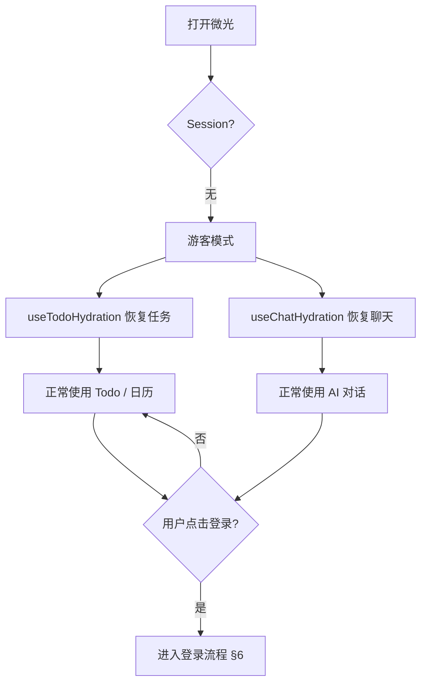
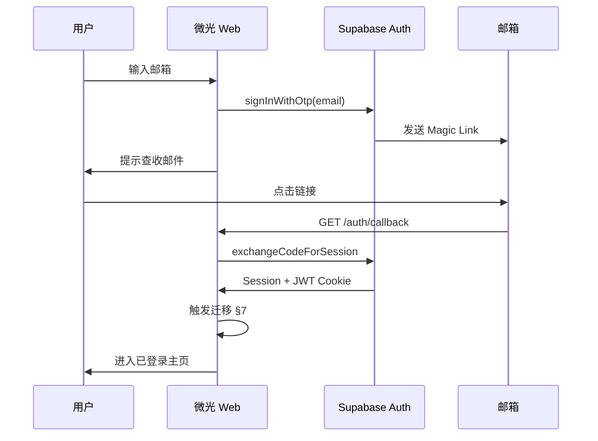
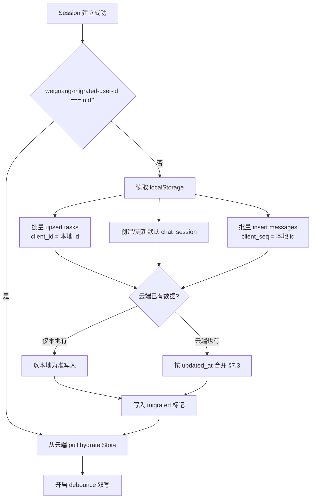
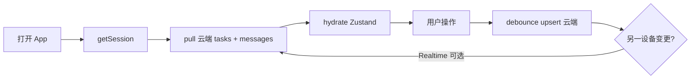
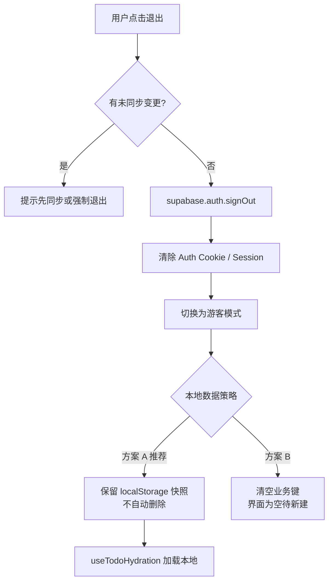
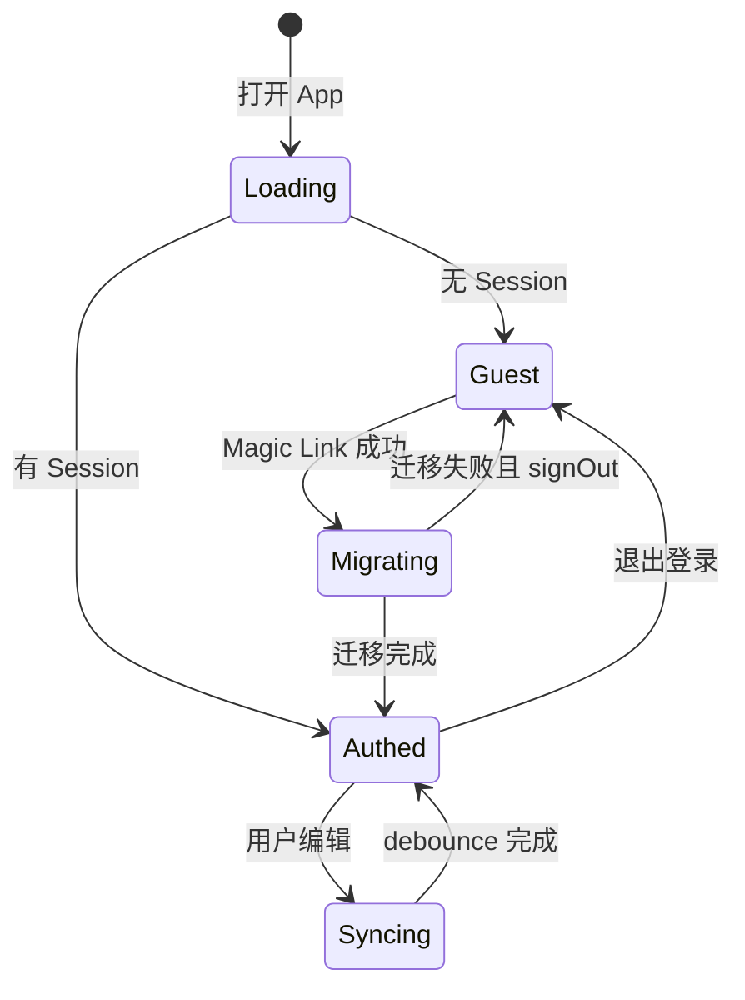

# 微光 Weiguang · V0.4 认证与用户流程方案

> 版本：V0.4（设计稿，**不修改现有业务代码**）  
> 依据：[DATABASE_DESIGN.md](./DATABASE_DESIGN.md) · [ARCHITECTURE.md](./ARCHITECTURE.md)  
> 登录栈：**Supabase Auth**（优先 **邮箱 Magic Link**）  
> 原则：游客无障碍使用 · 登录后本地数据上云 · PC/手机同一账号同步

---

## 1. 方案总览

| 维度 | 决策 |
|------|------|
| 认证提供商 | Supabase Auth |
| 首选登录方式 | 邮箱 **Magic Link**（无密码 OTP 链接） |
| 游客模式 | **保留**；未登录仅 `localStorage` |
| 游客能力 | Todo 增删改、日历、AI 对话（与现网一致） |
| 登录后存储 | Supabase Postgres 为权威；`user_id = auth.uid()` |
| 多端 | 同一邮箱账号 → 同一 `auth.users.id` → RLS 隔离下的共享数据 |
| MVP 不做 | 强制登录、Anonymous Auth、OAuth（可 V0.5 加） |

```
                    ┌─────────────────────────────────────┐
                    │           用户打开微光               │
                    └─────────────────┬───────────────────┘
                                      │
                    ┌─────────────────▼───────────────────┐
                    │     Supabase Session 有效？          │
                    └─────────┬───────────────┬───────────┘
                         否  │               │ 是
                              ▼               ▼
                    ┌──────────────┐  ┌──────────────────┐
                    │  游客模式     │  │  已登录模式       │
                    │  localStorage │  │  云端 + 双写同步  │
                    └──────────────┘  └──────────────────┘
```

---

## 2. 为什么采用 Supabase Auth

与数据库方案一致，避免自建会话与密码学细节：

| 能力 | 对微光的价值 |
|------|------------|
| Magic Link / OTP | 无密码、适合学生/轻度用户，减少「忘记密码」 |
| JWT + Refresh Token | Next.js App Router 用 `@supabase/ssr` 管理 Cookie |
| 与 `auth.users` 联动 | `profiles.id` 直接等于 `sub`，RLS 用 `auth.uid()` |
| Dashboard 配置 | 邮件模板、重定向 URL、速率限制开箱即用 |
| 后续扩展 | OAuth（微信需额外方案）、MFA、手机号 OTP 可同项目开启 |

**与 DATABASE_DESIGN 的衔接**：登录成功 ≠ 自动有业务数据；需执行 **§9 迁移** 将 `weiguang-tasks` / `weiguang-ai-chat` 写入 `tasks` / `chat_sessions` / `messages`。

---

## 3. 登录方式设计（Magic Link 优先）

### 3.1 主流程：邮箱 Magic Link

1. 用户在登录入口输入邮箱（需格式校验）。
2. 调用 `supabase.auth.signInWithOtp({ email, options: { emailRedirectTo } })`。
3. UI 展示：「已发送登录链接，请查收邮件（含垃圾箱）」。
4. 用户点击邮件中的链接 → 浏览器打开 **回调 URL** → Supabase 校验 token → 建立 Session。
5. 应用检测到 `SIGNED_IN` → 进入 **已登录模式** → 触发 **数据迁移**（若尚未迁移）。

**Supabase Dashboard 配置（实施时）**：

| 配置项 | 建议值 |
|--------|--------|
| Site URL | 生产域名，如 `https://weiguang.app` |
| Redirect URLs | `https://weiguang.app/auth/callback`、开发环境 `http://localhost:3000/auth/callback` |
| Email Auth | 启用 Email；Magic Link 模板可品牌化「微光」 |
| Confirm email | MVP 可关闭「注册须二次确认」，Magic Link 即完成验证 |

### 3.2 回调路由（实施时新增，本文仅规划）

```
用户点击邮件链接
    → GET /auth/callback?code=...&...
    → exchangeCodeForSession（@supabase/ssr）
    → Set-Cookie（httpOnly）
    → redirect 至 / 或 /?migrate=1
```

- **PC / 手机** 使用同一回调路径；Responsive 布局不变，仅多「账号」入口。
- 深链回 App：邮件 `emailRedirectTo` 必须带完整 origin，避免手机邮箱内置浏览器丢 Cookie 时提供「已登录，请回到微光」提示页。

### 3.3 备选登录（V0.5+，非 MVP）

| 方式 | 优先级 | 说明 |
|------|--------|------|
| Google / GitHub OAuth | 中 | Supabase Provider 一键开；适合技术用户 |
| 邮箱 + 密码 | 低 | Magic Link 已够用时不必首上 |
| 手机号 OTP | 低 | 需短信通道与合规 |

---

## 4. 身份状态模型

实施时建议在客户端（如 `authStore` 或 Context）维护：

| 状态 | 枚举建议 | 含义 |
|------|----------|------|
| 认证 | `guest` \| `authenticated` \| `loading` | 是否已有有效 Session |
| 迁移 | `idle` \| `running` \| `done` \| `error` | 本地 → 云端一次性导入 |
| 同步 | `idle` \| `syncing` \| `offline` \| `error` | 登录后的持续双写 |

**判定规则**：

- `loading`：首屏 `getSession()` 未完成，**不**读写云端，可暂时沿用 localStorage 展示（避免闪屏可短缓存 guest 数据）。
- `guest`：`session === null`，hydration 走现有 `useTodoHydration` / `useChatHydration`。
- `authenticated`：`session.user.id` 存在，hydration 走 `useTodoSync` / `useChatSync`（实施时命名）。

**localStorage 辅助键（迁移用，实施时写入）**：

| 键名 | 用途 |
|------|------|
| `weiguang-migrated-at` | ISO 时间戳；存在则跳过重复全量迁移 |
| `weiguang-migrated-user-id` | 上次迁移对应的 `auth.users.id`；与当前 uid 不一致时重新迁移 |
| `weiguang-tasks` / `weiguang-ai-chat` | 游客主数据；登录迁移后可选保留作离线缓存或清空 |

---

## 5. 游客模式（登录前）

### 5.1 产品承诺

- **无需注册** 即可使用全部 V1 功能：今日计划、任务 CRUD、日历、小光 AI 对话。
- 数据仅存本机：`STORAGE_KEYS.tasks`、`STORAGE_KEYS.aiChat`（见 `lib/storage.ts`）。
- **不调用** Supabase 业务表；`/api/chat` MVP 可仍匿名调用（与现网一致），V0.5 再强制 JWT。

### 5.2 游客用户流程



### 5.3 UI 触点（规划，不改现有代码）

| 端 | 建议位置 |
|----|----------|
| 桌面 | 左侧栏底部「登录 / 同步」；设置页内账号区 |
| 手机 | 设置 Tab 或顶部轻量入口；不打断双 Tab 主流程 |
| 文案 | 「登录后可在手机与电脑同步学习计划」 |

### 5.4 游客限制（透明告知，非硬拦）

| 项目 | 游客 | 登录后 |
|------|------|--------|
| 换设备 | 数据不跟随 | 自动同步 |
| 清缓存 | 可能丢失 | 云端可恢复 |
| 账号注销恢复 | 不适用 | 依赖云端备份策略 |

---

## 6. 登录流程（Magic Link）



### 6.1 异常与边界

| 场景 | 处理 |
|------|------|
| 邮件未收到 | 60s 冷却后可「重新发送」；提示检查垃圾箱 |
| 链接过期 | Supabase 默认有效期；提示重新登录 |
| 同一浏览器已登录其他账号 | 先 `signOut` 再登录，或明确「切换账号」 |
| 新用户首次 Magic Link | `auth.users` 创建 + Trigger 创建 `profiles` |
| 老用户再次登录 | 跳过迁移标记则直接 **拉取云端** 覆盖/合并 Store |

---

## 7. 登录后：数据迁移流程

迁移在 **首次登录成功** 或 **`migrated-user-id` ≠ 当前 uid** 时执行一次；与 DATABASE_DESIGN §9 一致。

### 7.1 迁移总流程



### 7.2 任务迁移（`weiguang-tasks` → `tasks`）

对每条本地 `TaskItem`：

```text
INSERT INTO tasks (
  user_id, client_id, text, done, date,
  category, priority, pomodoro_minutes, note,
  created_at, updated_at
) VALUES (...)
ON CONFLICT (user_id, client_id) DO UPDATE SET
  text, done, date, category, priority,
  pomodoro_minutes, note, updated_at = GREATEST(...)
```

- `client_id` = 本地 `TaskItem.id`。
- 服务端生成新 `id`（uuid）；Store 内在迁移完成后用 **服务端 id** 替换或维护 `id ↔ client_id` 映射表（实施时二选一，推荐逐步改用服务端 `id`）。

### 7.3 聊天迁移（`weiguang-ai-chat` → `chat_sessions` + `messages`）

1. `SELECT` 或 `upsert` 该用户 `is_default = true` 的 `chat_sessions`。
2. 写入 `reply_index` ← 本地 `replyIndex`。
3. 按 `messages[].id` 顺序插入 `messages`：`client_seq = id`，`content = text`，`role` 映射。
4. `last_message_at` = 最后一条消息的 `created_at`。

**冲突策略（云端已有历史时）**：

| 数据类型 | 规则 |
|----------|------|
| 任务 | 同 `client_id` 比较 `updated_at`，**较新者胜**；仅本地有则 insert |
| 消息 | MVP：**按 `client_seq` 去重**，已存在则 skip；不全量覆盖云端（防丢手机端新聊） |
| 默认会话 | 已存在则 update `reply_index` 取 `max(本地, 云端)` 或仅迁移缺失消息 |

### 7.4 迁移 UI

- 全屏或模态 **「正在同步你的学习计划…」**（`migration: running`）。
- 成功：Toast「已同步，可在其他设备继续」。
- 失败：保留本地数据，提供「重试」；`migration: error` 不阻塞浏览只读云端（若 pull 成功）。

### 7.5 迁移完成后的本地键

| 策略 | 说明 |
|------|------|
| **推荐** | 保留 `weiguang-tasks` 作离线队列，但以 `last_sync_at` 为准不再作为主源 |
| **可选** | 清空 `weiguang-tasks` / `weiguang-ai-chat`，强制下次只拉云端 |
| **必须** | 设置 `weiguang-migrated-at`、`weiguang-migrated-user-id` |

---

## 8. 登录后：日常使用与同步

### 8.1 已登录用户流程



- **写路径**：Store 变更 → 300–500ms debounce → Supabase `upsert`。
- **读路径**：冷启动 pull；可选 Realtime 订阅 `tasks`（DATABASE_DESIGN §11）。
- **AI 发送**：`/api/chat` 携带用户 JWT（实施时）；助手回复写入 `messages`。

### 8.2 与游客的代码分界（实施清单）

| 模块 | 游客 | 已登录 |
|------|------|--------|
| `useTodoHydration` | ✓ 主路径 | 仅离线降级 |
| `useTodoSync` | ✗ | ✓ 主路径 |
| `useChatHydration` | ✓ | 离线降级 |
| `useChatSync` | ✗ | ✓ |
| `/api/chat` | 可不校验 JWT（MVP） | 校验 JWT + `user_id` 写库 |

---

## 9. 退出登录流程



### 9.1 推荐策略（方案 A）

- **退出 ≠ 删数据**：本机 `weiguang-tasks` / `weiguang-ai-chat` 保留为「离线副本」。
- 清除 `weiguang-migrated-user-id`（或整段迁移标记），避免下次登录误判已迁移。
- 再次登录同一账号：先 pull 云端（权威），再按需把本地仅存在的记录 merge 上去。

### 9.2 安全

- 退出后 JWT 失效，无法读他人数据。
- 公共设备建议 UI 提示「退出并清除本地数据」（可选按钮，执行 `localStorage.removeItem` 业务键）。

### 9.3 不清除的内容

- `sessionStorage` 的 `weiguang-welcome-seen` 可保留（非敏感）。
- 云端数据 **不** 随退出删除（除非用户走「注销账号」产品流程，另文档规划）。

---

## 10. PC 与手机：同一账号如何同步

核心：**账号 = `auth.users.id` = 所有业务表的 `user_id`**。与设备、浏览器无关。

```
┌──────────────┐     Magic Link      ┌──────────────┐
│  PC 浏览器    │ ◄──────────────► │ Supabase Auth │
│  user_id = X │                   │  同一邮箱      │
└──────┬───────┘                   └──────┬───────┘
       │                                  │
       │         ┌────────────────────────┘
       │         │
       ▼         ▼
┌─────────────────────────────────────────────┐
│           Postgres (RLS: user_id = X)        │
│  tasks · chat_sessions · messages · profiles │
└─────────────────────────────────────────────┘
       ▲         ▲
       │         │
┌──────┴───┐ ┌───┴──────┐
│ 手机浏览器 │ │ 平板浏览器 │
│ user_id = X│ │ user_id = X│
└──────────┘ └────────────┘
```

### 10.1 典型场景

| 场景 | 行为 |
|------|------|
| 游客在 PC 建任务，手机未登录 | 手机看不到；各自 localStorage 独立 |
| PC 登录并迁移 | 任务上云 `user_id = X` |
| 手机用 **同一邮箱** Magic Link 登录 | pull 云端，看到 PC 任务 |
| PC 改任务完成态 | debounce 写云端；手机下次打开或 Realtime 看到更新 |
| 手机聊小光 | 消息写入 `messages`；PC 打开陪伴 Tab pull 历史 |

### 10.2 同时在线（MVP）

- **默认**：最后写入者按 `updated_at` 胜；无 Realtime 时需刷新或重新进入页面。
- **增强**：订阅 `tasks` 表 `UPDATE`（DATABASE_DESIGN §11 阶段 D）。

### 10.3 布局差异不影响 Auth

- PC 三栏 / 手机双 Tab **共用** Session Cookie（同域）或同域 PWA。
- 登录入口位置不同，**回调与 Session 存储规则相同**。

### 10.4 跨域注意

- 生产须 **单一主域**（如 `app.weiguang.com`），PC/手机均为该域响应式；避免 `www` / 裸域 Cookie 不一致导致「登录了却不同步」。

---

## 11. Session 与技术集成（实施参考）

### 11.1 依赖（规划）

```text
@supabase/supabase-js
@supabase/ssr
```

### 11.2 文件落点（与 ARCHITECTURE 对齐）

| 路径 | 职责 |
|------|------|
| `lib/supabase/client.ts` | 浏览器 Client |
| `lib/supabase/server.ts` | Server Components / Route Handlers |
| `lib/supabase/middleware.ts` | 刷新 Session（可选） |
| `middleware.ts` | 匹配 `/auth/*`，更新 Cookie |
| `app/auth/callback/route.ts` | Magic Link 回调 |
| `app/auth/login/page.tsx` 或 `components/auth/LoginModal.tsx` | 邮箱输入 UI |
| `hooks/useAuth.ts` | `onAuthStateChange`、guest/authenticated |
| `lib/migration/importLocalData.ts` | §7 迁移纯函数 |
| `hooks/useMigration.ts` | 登录后触发迁移 |

### 11.3 环境变量

```text
NEXT_PUBLIC_SUPABASE_URL=
NEXT_PUBLIC_SUPABASE_ANON_KEY=
# 仅服务端
SUPABASE_SERVICE_ROLE_KEY=
```

### 11.4 `/api/chat` 与登录（分阶段）

| 阶段 | 行为 |
|------|------|
| MVP Auth | 游客仍可聊；登录用户可选带头 `Authorization: Bearer` |
| V0.5 | BFF 校验 JWT，`messages` 必写 `user_id` |
| 安全 | API Key 永不出现在浏览器 |

---

## 12. 安全与合规要点

| 项 | 措施 |
|----|------|
| Cookie | `httpOnly`、`Secure`（生产）、`SameSite=Lax` |
| CSRF | Magic Link 由 Supabase 签发；回调仅换 code |
| RLS | 所有业务 SQL 经 anon key + JWT，禁止信任客户端传的 `user_id` |
| 邮箱枚举 | 统一文案「若邮箱有效将收到邮件」，不暴露是否注册 |
| XSS | 延续 React 转义；避免 `dangerouslySetInnerHTML` 渲染聊天 |
| 迁移幂等 | `client_id` / `client_seq` 唯一约束，重复登录不重复插 |
| 登出 | 清除 Session；公共设备提供清本地选项 |

---

## 13. 状态机一览



---

## 14. 实施顺序（仅 Auth 相关）

与 [DATABASE_DESIGN.md §14](./DATABASE_DESIGN.md#14-下一步实施顺序) 衔接：

| 步 | 事项 |
|----|------|
| 1 | Supabase 项目 + Email Magic Link 模板与 Redirect URL |
| 2 | 执行 DATABASE_DESIGN §13 建表 + RLS + `handle_new_user` |
| 3 | `lib/supabase/*` + `/auth/callback` + `useAuth` |
| 4 | 登录 UI（邮箱输入 + 发送状态） |
| 5 | `importLocalData` + 迁移 UI + `weiguang-migrated-*` |
| 6 | `useTodoSync` / `useChatSync`（authenticated 分支） |
| 7 | 设置页「退出登录」 |
| 8 | `/api/chat` JWT 校验（可选后置） |
| 9 | Realtime 多端近实时（可选） |

**本阶段文档交付**：不修改 `store/*`、`hooks/use*Hydration`、`app/page.tsx` 等现有业务代码。

---

## 15. 附录：流程对照表

| 用户动作 | 认证状态 | 任务数据 | 聊天数据 |
|----------|----------|----------|----------|
| 首次打开 | 游客 | localStorage | localStorage |
| 使用 Todo | 游客 | 写 localStorage | — |
| 与小光聊天 | 游客 | — | 写 localStorage |
| 发送 Magic Link | 待验证 | 不变 | 不变 |
| 点击邮件链接 | 已登录 | 触发迁移 → 云端 | 触发迁移 → 云端 |
| 日常编辑 | 已登录 | 双写云端 | 双写云端 |
| 另一设备登录同邮箱 | 已登录 | pull 云端 | pull 云端 |
| 退出 | 游客 | 读本地副本（方案 A） | 读本地副本 |

---

## 16. 文档维护

- Auth 行为变更请同步更新本文档与 `DATABASE_DESIGN.md` §9、§11。
- OAuth / 手机号登录上线时增加 §3.3 子节，不推翻游客 + Magic Link 主路径。
- 实施完成后在 `ARCHITECTURE.md` 增加「认证与同步」章节并链接本文档。

---

*微光 · 温柔陪伴你的学习与小目标*
