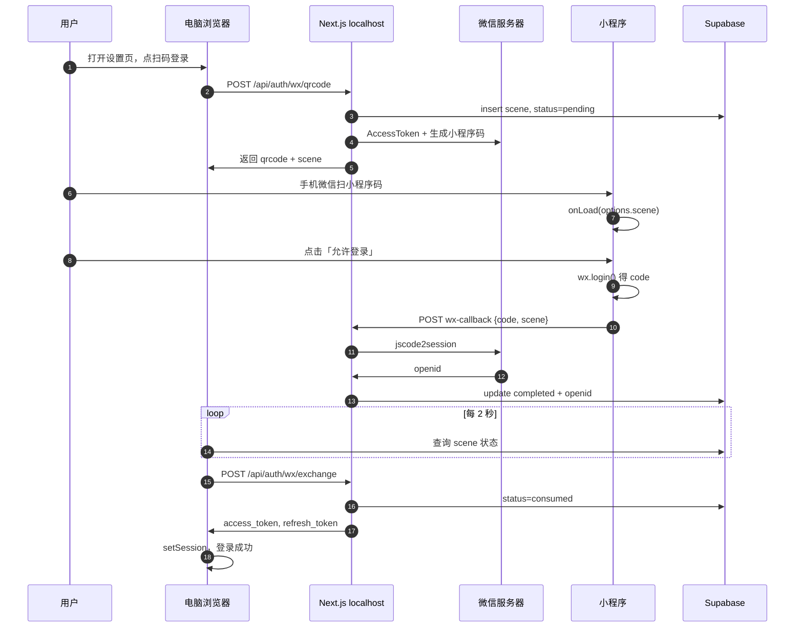

# 微光 · 微信扫码登录完整学习手册

> 适用项目：`weiguang-app`（Next.js + Supabase + 微信小程序）  
> 文档版本：2026-05  
> 阅读建议：按章节顺序阅读，第二章起可对照实操。

---

## 目录

1. [你要解决什么问题](#1-你要解决什么问题)
2. [三个角色与两个项目](#2-三个角色与两个项目)
3. [核心概念词典](#3-核心概念词典)
4. [完整成功流程（时序说明）](#4-完整成功流程时序说明)
5. [本地联调原理](#5-本地联调原理)
6. [关键文件与配置对照表](#6-关键文件与配置对照表)
7. [常见失败与排查](#7-常见失败与排查)
8. [操作 Checklist（保存备用）](#8-操作-checklist保存备用)
9. [进阶：上线前后要注意什么](#9-进阶上线前后要注意什么)
10. [附录：API 与数据库](#10-附录api-与数据库)

---

## 1. 你要解决什么问题

### 1.1 业务目标

用户在 **电脑浏览器** 打开微光网页，希望用 **微信** 登录，而不是记密码。

实现方式不是「网页里嵌微信网页授权」（那要备案域名），而是：

1. 电脑展示一张 **微信小程序码**；
2. 用户用手机微信扫码，在 **小程序** 里点「允许登录」；
3. 电脑网页自动变成已登录状态。

### 1.2 技术方案一句话

> 电脑生成一次性暗号 `scene` 并画进小程序码 → 小程序扫码后把 `scene` 和微信 `code` 交给本机 Next.js → 后端换 `openid` 写入 Supabase → 电脑轮询发现完成 → 兑换浏览器登录 Session。

---

## 2. 三个角色与两个项目

### 2.1 三个角色

| 角色 | 运行位置 | 职责 |
|------|----------|------|
| **电脑网页** | 浏览器 `localhost:3000` | 出码、轮询、最终登录 |
| **微信服务器** | 腾讯云端 | Token、小程序码、`code→openid` |
| **微信小程序** | 开发者工具 / 手机微信 | 扫码落地页、用户点授权 |

### 2.2 两个项目（极易混淆）

| 项目 | 文件夹 | 用什么打开 |
|------|--------|------------|
| **A. Next.js 网页** | `d:\Learn\weiguang-app\` | VS Code + `npm run dev` |
| **B. 微信小程序** | `d:\Learn\weiguang-app\miniprogram\` | **微信开发者工具** |

- 生成码、换 openid、写数据库：**A**
- 扫码后看到的页面、点「允许登录」：**B**
- 两边 **AppID 必须相同**（`.env.local` 里的 `NEXT_PUBLIC_WX_APPID`）

### 2.3 结构示意图

```
┌─────────────────┐         ┌─────────────────┐
│  A. Next.js     │         │  B. 小程序       │
│  (电脑网页后端)  │         │  (微信里运行)    │
└────────┬────────┘         └────────┬────────┘
         │                           │
         │    ┌───────────────┐      │
         └───►│  Supabase 云  │◄─────┘（轮询读状态）
              │  wx_login_    │
              │  sessions     │
              └───────┬───────┘
                      │
         ┌────────────┴────────────┐
         ▼                         ▼
  ┌─────────────┐          ┌─────────────┐
  │ 微信服务器   │          │ 你的浏览器   │
  │ Token/码/   │          │ Cookie 登录  │
  │ openid      │          └─────────────┘
  └─────────────┘
```

---

## 3. 核心概念词典

### 3.1 scene（场景值）

| 项目 | 说明 |
|------|------|
| **是什么** | 每次点击「微信扫码登录」时随机生成的一串字符（约 24 位） |
| **不是什么** | 不是磁盘上的文件，不是微信固定配置 |
| **作用** | 把「电脑正在等的这一次登录」和「手机刚扫的那次」绑成一对 |
| **怎么传递** | 编进小程序码 → 扫码后出现在 `onLoad(options.scene)` |
| **存在哪** | Supabase 表 `wx_login_sessions` 的主键 `scene` |

**类比**：餐厅叫号器上的号码——电脑拿号等位，手机扫码相当于「叫到号了」。

### 3.2 AppID 与 AppSecret

| 名称 | 位置 | 用途 |
|------|------|------|
| **AppID** | `.env.local` → `NEXT_PUBLIC_WX_APPID` | 标识是哪个小程序（可给前端知道） |
| **AppSecret** | `.env.local` → `WX_APP_SECRET` | 服务端密钥，**仅 Next.js 使用** |

Secret 绝不能写在小程序 `login.js` 里，否则任何人能反编译偷走。

### 3.3 code（临时登录凭证）

- 来源：小程序 `wx.login()` 返回
- 寿命：很短（约 5 分钟）
- 用途：交给 **你的后端**，后端再向微信换 **openid**
- 用户身份：**不是** code 本身，而是换到的 openid

### 3.4 openid

- 某个微信用户 **在你的这个小程序里** 的唯一 ID
- 同一用户在不同小程序 openid 不同
- 后端用它创建/查找 Supabase 用户，完成网页登录

### 3.5 小程序码 vs 普通二维码

| 类型 | 扫了会怎样 |
|------|------------|
| **普通二维码** | 打开网址 |
| **微信小程序码** | 打开指定小程序的指定页面，并带上 `scene` |

电脑「微信扫码登录」生成的是 **小程序码**（接口 `getwxacodeunlimit`）。

### 3.6 wx_login_sessions 表状态

| status | 含义 |
|--------|------|
| `pending` | 电脑已出码，等人扫码确认 |
| `completed` | 小程序已写入 openid，网页可兑换登录 |
| `consumed` | 网页已用 scene 换过 Session，防重复使用 |
| `expired` | 超时（默认约 5 分钟） |

**注意**：必须用 `completed`，不是 `confirmed`（数据库约束与代码一致）。

### 3.7 开发版 / 体验版 / 正式版

| env_version | 何时用 |
|-------------|--------|
| `develop` | 本地开发、测试号（`.env` 里 `WX_MP_ENV_VERSION=develop`） |
| `trial` | 体验版 |
| `release` | 已正式发布上线 |

测试号扫 `release` 码常会失败，本地请用 `develop`。

---

## 4. 完整成功流程（时序说明）

### 4.1 步骤总览

| 步骤 | 谁 | 做什么 |
|------|-----|--------|
| 1 | 用户 | 浏览器打开 `/settings`，点「微信扫码登录」 |
| 2 | Next.js | `POST /api/auth/wx/qrcode`：生成 scene，插入 DB，向微信要小程序码 |
| 3 | 浏览器 | 显示二维码 + scene（开发时可复制） |
| 4 | 用户 | **手机微信**扫该码（非开发者工具「普通编译」） |
| 5 | 微信 | 打开小程序 `pages/login/login`，传入 `options.scene` |
| 6 | 用户 | 点「允许登录」 |
| 7 | 小程序 | `wx.login` → `POST /api/auth/wx-callback` 发送 `{ code, scene }` |
| 8 | Next.js | `code` 换 `openid`，更新 DB：`status=completed` |
| 9 | 浏览器 | 每 2 秒查 Supabase，发现 completed |
| 10 | Next.js | `POST /api/auth/wx/exchange`，返回 Session |
| 11 | 浏览器 | `setSession`，显示已登录 |

### 4.2 时序图（Mermaid）



---

## 5. 本地联调原理

### 5.1 为什么 localhost 也能用？

| 通信路径 | 是否经过备案域名 |
|----------|------------------|
| 浏览器 → `localhost:3000`（出码、exchange） | 否，本机 |
| Next.js → `api.weixin.qq.com` | 否，服务端直连微信 |
| 小程序 → `localhost:3000`（wx-callback） | 否，开发期允许 |
| 浏览器/小程序 → Supabase 云 | 否，公网 API |

**备案**主要影响：正式环境「网页授权回调域名」等；当前方案不依赖网页被微信 OAuth 回调。

### 5.2 两条联调线路

**线路 1：出码（与开发者工具无关）**

```
浏览器 → 本机 Next.js → 微信 API → 返回图片
```

**线路 2：确认登录（小程序找本机 Next）**

```
小程序 wx.request → http://localhost:3000/api/auth/wx-callback
```

前提：

1. `npm run dev` 正在运行；
2. `miniprogram/utils/config.js` 里 `API_BASE` 指向本机；
3. 开发者工具勾选：**不校验合法域名、web-view、TLS**。

### 5.3 普通编译 vs 扫电脑码

| 进入方式 | 有 scene？ | 能否点「允许登录」？ |
|----------|------------|----------------------|
| 开发者工具「普通编译」 | 否 | 否（可用手动填入 scene 调试） |
| 扫电脑网页生成的小程序码 | 是 | 是 |

### 5.4 真机调试注意

手机访问不到你电脑上的 `localhost`，需把 `config.js` 改为局域网 IP，例如：

```javascript
const API_BASE = "http://192.168.1.100:3000";
```

电脑与手机同一 WiFi；Windows 防火墙放行 3000 端口。

---

## 6. 关键文件与配置对照表

### 6.1 电脑端（Next.js）

| 文件 | 作用 |
|------|------|
| `.env.local` | AppID、Secret、Supabase、小程序页面路径 |
| `app/api/auth/wx/qrcode/route.ts` | 生成 scene + 小程序码 |
| `app/api/auth/wx-callback/route.ts` | code + scene → openid → DB |
| `app/api/auth/wx/exchange/route.ts` | scene → 浏览器 Session |
| `app/api/auth/wx/ping/route.ts` | 自检 Token |
| `lib/wechat.ts` | 微信 API 封装 |
| `components/auth/WechatScanLogin.tsx` | 网页扫码 UI + 轮询 |

### 6.2 小程序端

| 文件 | 作用 |
|------|------|
| `miniprogram/app.json` | 注册页面路径 |
| `miniprogram/pages/login/login.js` | scene 解析、wx.login、请求后端 |
| `miniprogram/utils/config.js` | 本机 API 地址 |

### 6.3 环境变量示例

```env
NEXT_PUBLIC_WX_APPID=你的AppID
WX_APP_SECRET=你的Secret
WX_MP_ENV_VERSION=develop
WX_MP_LOGIN_PAGE=pages/login/login
SUPABASE_SERVICE_ROLE_KEY=你的ServiceRole
```

`WX_MP_LOGIN_PAGE` 必须与 `app.json` 的 `pages` 中某项 **完全一致**。

---

## 7. 常见失败与排查

### 7.1 问题速查表

| 现象 | 可能原因 | 处理 |
|------|----------|------|
| 页面不存在 | 小程序无该页 / 未编译 / AppID 不一致 | 用 `miniprogram` 目录导入，先编译成功再扫码 |
| 未获取 scene | 普通编译进入，未扫电脑码 | 扫设置页生成的小程序码，或复制 scene 到开发调试 |
| 找不到 scene 文件 | 误解 scene 含义 | scene 是运行时随机串，在网页出码后显示 |
| 允许登录网络失败 | Next 未启动 / 域名校验 | `npm run dev` + 不校验合法域名 |
| invalid credential | AppID/Secret 错误 | 对照小程序后台开发设置 |
| invalid page (41030) | 页面路径错误 | 改 `WX_MP_LOGIN_PAGE` 与 app.json 一致 |
| 电脑一直不登录 | DB 未 completed / exchange 失败 | 看 Supabase 表、浏览器 Network |

### 7.2 推荐自检顺序

1. `http://localhost:3000/api/auth/wx/ping` → `ok: true`
2. 开发者工具编译 → 模拟器能见登录页
3. 设置页出码 → 手机扫码（非普通编译）
4. 小程序 Network → `wx-callback` 状态码 200
5. Supabase → 对应 scene 行为 `completed`

---

## 8. 操作 Checklist（保存备用）

### 8.1 首次联调

- [ ] `.env.local` 配齐 AppID、Secret、Service Role、`WX_MP_ENV_VERSION=develop`
- [ ] Supabase 已执行 `supabase/sql/wx_login_init.sql`
- [ ] 微信开发者工具导入 `miniprogram`，AppID 一致
- [ ] 勾选不校验合法域名
- [ ] 编译后模拟器可见登录页
- [ ] `npm run dev` 启动
- [ ] `/api/auth/wx/ping` 返回成功
- [ ] 设置页出码，**手机微信扫码**
- [ ] 小程序点「允许登录」
- [ ] 电脑网页显示已登录

### 8.2 仅模拟器调试（不扫码）

- [ ] 电脑先出码，复制网页上的 scene
- [ ] 粘贴到小程序「开发调试」→ 填入 scene
- [ ] 点「允许登录」

---

## 9. 进阶：上线前后要注意什么

### 9.1 上线前

| 项 | 说明 |
|----|------|
| 合法域名 | 小程序后台配置 request 合法域名为你的正式 HTTPS 域名 |
| config.js | 改为 `https://你的域名`，不能用 localhost |
| env_version | 正式用户扫码可用 `release` |
| Secret | 仅服务器环境变量，勿提交 Git |
| HTTPS | 正式 API 必须 HTTPS |

### 9.2 安全要点

- `scene` 应足够随机（本项目已用加密随机）
- `exchange` 只能消费一次（`consumed`）
- scene 有过期时间（约 5 分钟）
- Service Role Key 绝不放前端、不放小程序

### 9.3 与「网页微信 OAuth」的区别

| 方式 | 是否需要备案域名 | 用户路径 |
|------|------------------|----------|
| 网页 OAuth 跳转 | 需要配置授权回调域 | 电脑浏览器跳微信再跳回 |
| **本方案（小程序码）** | 电脑网页域名要求低 | 手机扫小程序码 |

---

## 10. 附录：API 与数据库

### 10.1 HTTP 接口

| 方法 | 路径 | 调用方 |
|------|------|--------|
| GET | `/api/auth/wx/ping` | 浏览器（自检） |
| POST | `/api/auth/wx/qrcode` | 浏览器（出码） |
| POST | `/api/auth/wx-callback` | 小程序（授权） |
| POST | `/api/auth/wx/exchange` | 浏览器（登录） |
| POST | `/api/auth/wx/confirm` | 可选，直接传 openid |

### 10.2 表结构（wx_login_sessions）

| 字段 | 类型 | 说明 |
|------|------|------|
| scene | text PK | 场景值 |
| openid | text | 微信用户 ID |
| status | text | pending / completed / consumed / expired |
| user_id | uuid | 兑换后关联的 Supabase 用户 |
| expires_at | timestamptz | 过期时间 |

---

## 结语

你已经跑通了一次完整闭环，说明：

- 两个项目的关系是对的；
- scene 只是「一次登录的配对号」；
- 本机 Next.js 是小程序和网页之间的「桥梁」；
- Supabase 是双方都能看到的「状态板」。

以后只要按 **第八章 Checklist** 逐项核对，大部分问题都能在 5 分钟内定位。

---

*微光 weiguang-app · 内部学习文档 · 可与 `miniprogram/新手必读-扫码登录.md`、`docs/WX_SCAN_LOGIN.md` 对照阅读*
